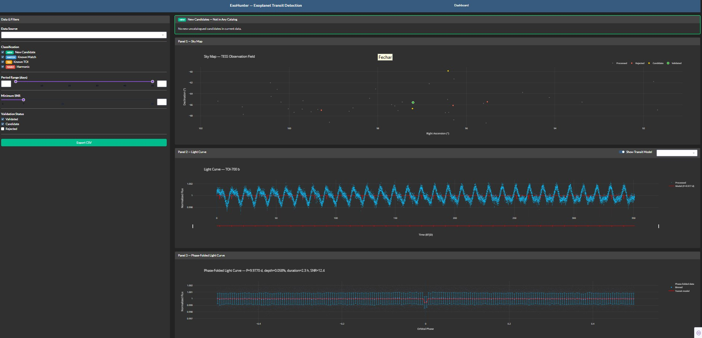
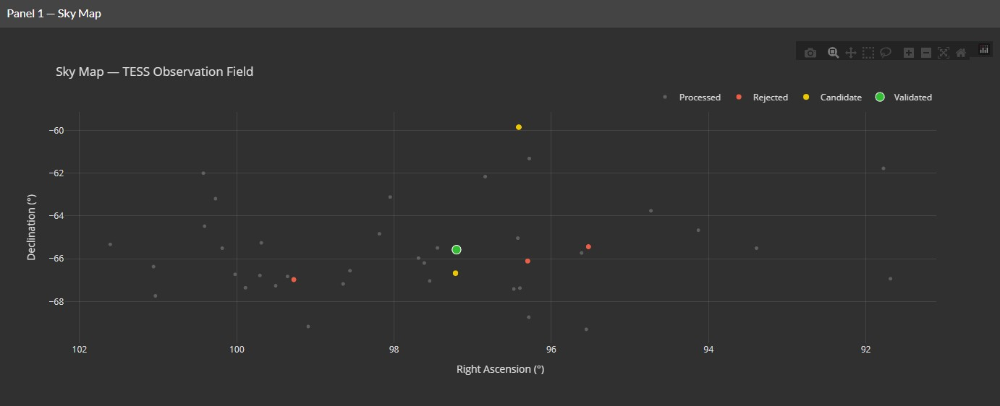
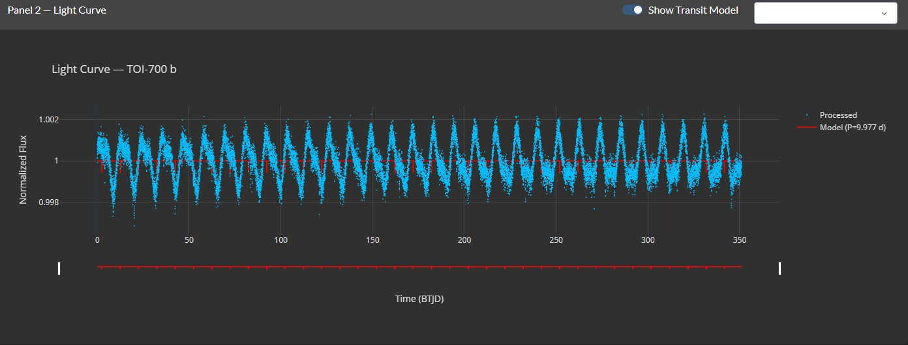
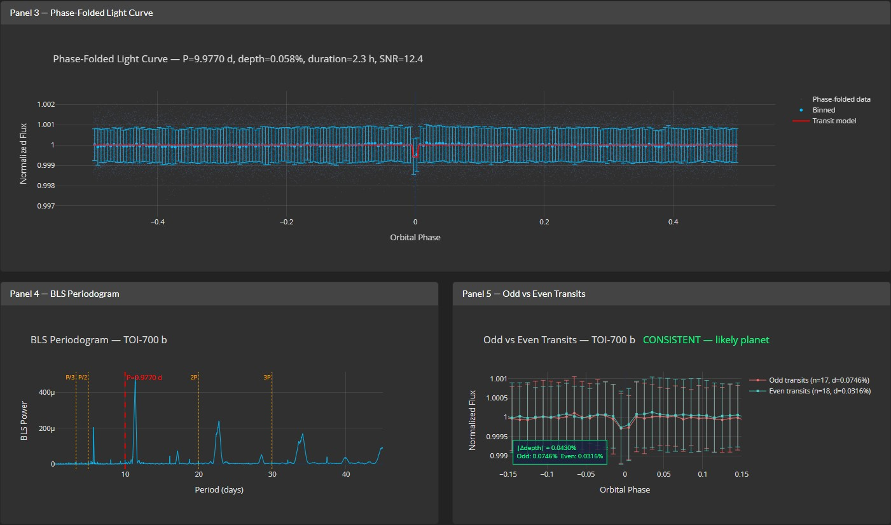

# Dashboard User Guide

This guide explains how to use ExoHunter's interactive Plotly Dash
dashboard to explore transit detection results, inspect candidates,
and monitor the pipeline status.

---

## 1. Launching the dashboard

```bash
# Default: loads synthetic TOI-700 demo data
python scripts/run_dashboard.py

# Start empty (load data from the selector)
python scripts/run_dashboard.py --empty

# Custom port
python scripts/run_dashboard.py --port 8080
```

Open [http://localhost:8050](http://localhost:8050) in your browser.

---

## 2. Layout overview

The dashboard is organized top-to-bottom:

```
┌─────────────────────────────────────────────────────┐
│  Navbar                                             │
├───────────┬─────────────────────────────────────────┤
│  Sidebar  │  New Candidates Highlight Panel         │
│  (filters)│  Sky Map (Panel 1)                      │
│           │  Light Curve (Panel 2)                  │
│           │  Phase Diagram (Panel 3)                │
│           │  BLS Periodogram + Odd-Even (Panels 4-5)│
├───────────┴─────────────────────────────────────────┤
│  Candidate Table                                    │
├─────────────────────────────────────────────────────┤
│  Data Overview (cache, ML, results, reports, alerts)│
└─────────────────────────────────────────────────────┘
```

[](imgs/dashboard_full.jpg)

---

## 3. Sidebar — data source and filters

### Data source selector

The dropdown at the top of the sidebar lets you switch between:

- **Demo — TOI-700**: synthetic data with 3 planets (default)
- **Sector NN (N targets)**: batch results from `data/results/`

When you select a sector, the candidate table and sky map update
automatically. Light curve and phase plots are available only for
the demo (batch mode doesn't store light curves).


### Filters

| Filter | What it does |
|--------|-------------|
| **Classification** | Toggle which cross-match classes to show: NEW_CANDIDATE, KNOWN_MATCH, KNOWN_TOI, HARMONIC |
| **Period Range** | Slider from 0.5 to 50 days |
| **Minimum SNR** | Slider from 0 to 50 (default: 7) |
| **Validation Status** | Checkbox: validated, candidate, rejected |

All filters apply to the candidate table in real-time. The sky map
and plots are not affected by filters — they show all loaded data.

---

## 4. Visualization panels

### Panel 1 — Sky Map

A scatter plot of all targets in Right Ascension / Declination
coordinates, with the ESO/S. Brunier Milky Way panorama as the
background image. Marker sizes scale with transit depth (deeper
transits produce larger circles), and important statuses have a
neon glow effect. RA axis follows the astronomical convention
(reversed, with hour-angle labels). Color-coded by status:

| Color | Status |
|-------|--------|
| Bright green (#00ff88) | NEW_CANDIDATE — not in any catalog |
| Deep sky blue | KNOWN_MATCH — re-detection of known planet |
| Gold | KNOWN_TOI — known star, different period |
| Orange | HARMONIC — period alias |
| Gray | Processed (no detection) |
| Red | Rejected |

**Click** a point to select that target — the light curve, phase
diagram, and candidate selector update.

[](imgs/dashboard_skymap.jpg)

### Panel 2 — Light Curve

Shows the full time series of normalized flux for the selected target.
Features:

- **Range slider** at the bottom for zooming into specific time windows
- **Transit model overlay** (red line) when "Show Transit Model" is enabled
- **Transit windows** highlighted as semi-transparent red bands
- **Candidate selector dropdown** for multi-planet targets — switch
  between planets b, c, d, etc.

[](imgs/dashboard_lightcurve.jpg)

### Panel 3 — Phase-Folded Light Curve

The light curve folded at the detected period, centered on the transit:

- **Gray dots**: individual phase-folded data points
- **Blue circles**: binned averages with error bars
- **Red line**: trapezoidal transit model fit

The title shows: period, depth (%), duration (hours), and SNR.

### Panel 4 — BLS Periodogram

The BLS power spectrum showing how strongly each trial period matches
a box-shaped transit:

- **Red dashed line**: detected period (peak)
- **Orange dotted lines**: harmonic markers (2P, P/2, 3P, P/3)

Peaks at harmonics are common and don't indicate additional planets —
they're aliases of the main signal.

### Panel 5 — Odd vs Even Transits

Eclipsing binary check: splits transit events into odd-numbered and
even-numbered, phase-folds each separately, and overlays:

- **Red circles**: odd transits
- **Teal squares**: even transits

If the depths differ significantly (> 3-sigma), the title shows
"INCONSISTENT — possible eclipsing binary". If they agree, it shows
"CONSISTENT — likely planet".

---

[](imgs/dashboard_phase_bls_oddvseven.jpg)

---

## 5. Candidate table

A sortable, filterable table with all candidates matching the current
filters. Columns:

| Column | Description |
|--------|-------------|
| TIC ID | TESS Input Catalog identifier |
| Planet | Name (e.g., "TOI-700 b") if known |
| Period (d) | Orbital period in days |
| Epoch (BTJD) | Mid-transit time |
| Duration (d) | Transit duration |
| Depth (%) | Transit depth as percentage |
| SNR | Signal-to-noise ratio |
| Score | Priority score (SNR × v_shape × depth penalties) |
| Classification | Cross-match result (NEW_CANDIDATE, KNOWN_MATCH, etc.) |
| ML Class | Random Forest or CNN prediction (planet, eclipsing_binary, false_positive) |
| ML P(planet) | Classifier confidence that this is a real planet (0–1) |
| Status | Validation status (Validated, Candidate, Rejected) |
| Flags | Validation warnings |

### Row colors

- **Bright green + bold**: NEW_CANDIDATE (potential new exoplanet)
- **Blue tint**: KNOWN_MATCH
- **Yellow tint**: KNOWN_TOI
- **Orange tint**: HARMONIC
- **Green tint**: ML class = planet
- **Red tint**: ML class = eclipsing_binary

**Click a row** to select that target and update the plots.

**Export**: click "Export CSV" in the sidebar to download the filtered
table as a CSV file.

---

## 6. New Candidates Highlight Panel

A green-bordered card above the sky map showing the top 10
uncatalogued candidates by score. Each entry shows:

- Green "NEW" badge
- TIC ID
- Period, depth, SNR, score

This panel auto-updates when the data source changes. If no
NEW_CANDIDATE entries exist, it shows a placeholder message.

---

## 7. Data Overview section

Below the candidate table, five status cards provide a bird's-eye
view of all pipeline data on disk.

### Cache Statistics

Shows the number of cached FITS light curves and total disk usage.
Lists the 3 largest cached targets.

### ML Model Status

Shows which classifiers are trained and available:

- **Random Forest** (transit_classifier.joblib)
- **CNN** (transit_cnn.pt)

Each shows a "Trained" badge (blue/green) or "Not trained" (gray).

### Batch Results Index

Lists all sector CSV files in `data/results/` with:
- Target count
- Number of validated candidates
- Green "NEW" badge if NEW_CANDIDATE entries exist
- Processing date and mode (standard / multi-sector)

### Diagnostic Reports Gallery

Thumbnail grid of PNG reports generated by `inspect_candidate.py`.
**Click** a thumbnail to open the full-size 4-panel diagnostic report
in a modal overlay.

### Alerts Feed

Timeline of alert JSON files from `data/alerts/`. Each entry shows:
- Sector badge
- Number of new candidates
- TIC IDs of the top candidates
- Timestamp

---

## 8. Interpreting results

### What makes a good candidate?

| Criterion | Good sign | Bad sign |
|-----------|-----------|----------|
| SNR | >= 7 (higher is better) | < 7 (likely noise) |
| Depth | 0.01%–2% | > 5% (eclipsing binary) |
| V-shape | Box-like (test passed) | V-shaped (test failed) |
| Odd-even | CONSISTENT | INCONSISTENT |
| Classification | NEW_CANDIDATE | HARMONIC |
| ML class | planet (high confidence) | false_positive |
| Score | > 10 | < 5 |

### Workflow for investigating candidates

1. **Filter** the table by classification = NEW_CANDIDATE + validated
2. **Sort** by Score (descending) to see the most promising first
3. **Click** a row to view its light curve and phase-fold
4. **Check** the BLS periodogram for clean peaks (no harmonics dominating)
5. **Check** the odd-even comparison for consistency
6. **Run** `inspect_candidate.py` for a full diagnostic report
7. If the ML classifier is trained, check ML P(planet) > 0.7

### Common false positive patterns

| Pattern | What you see | What it means |
|---------|-------------|---------------|
| V-shaped dip | Phase plot shows pointed bottom | Eclipsing binary |
| Very deep transit (>5%) | Depth column shows large value | Eclipsing binary |
| Period at 1/2 or 2x of another candidate | Periodogram shows harmonic peaks | Period alias |
| Inconsistent odd-even depths | Odd-even panel shows different depths | Eclipsing binary at 2x the period |
| Short duration relative to period | Duration/period > 25% | Instrumental artefact |

---

## 9. Keyboard shortcuts and tips

- Use the **range slider** below the light curve to zoom into specific
  time windows without losing context
- **Hover** over any data point to see its exact values
- **Double-click** on a Plotly figure to reset the zoom
- The **candidate selector dropdown** (top right of Panel 2) switches
  between planets in multi-planet systems
- **Export CSV** exports only the filtered rows, not all data
