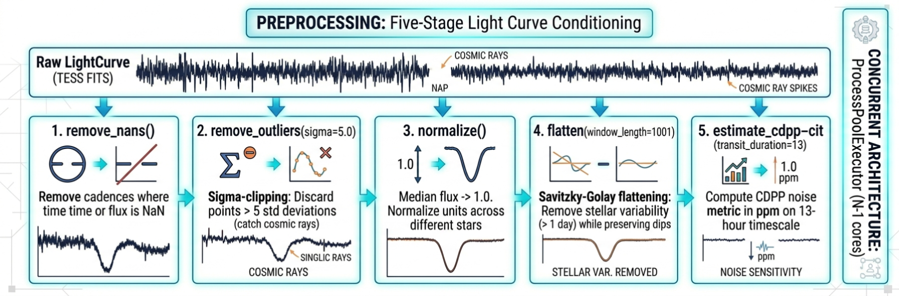
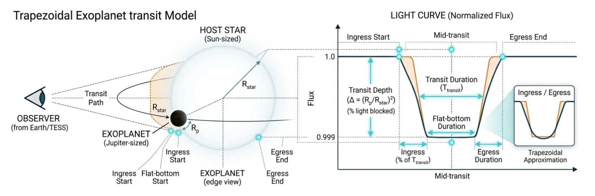
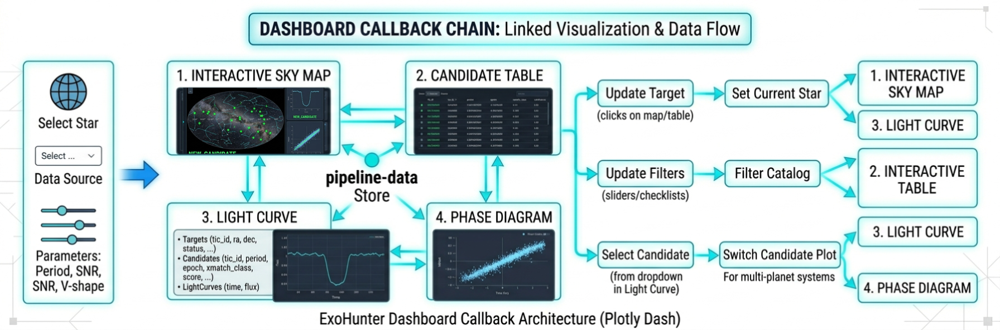

# Methodology: How ExoHunter Works

This document describes what the code does, how each stage is
implemented, and why specific design decisions were made. It is written
for developers who want to reproduce, extend, or audit the pipeline.

---

## 1. Overview

ExoHunter is a five-stage pipeline:


Each stage is a separate Python package (`exohunter/ingestion/`,
`exohunter/preprocessing/`, etc.) with clearly defined input and
output data structures.

---

## 2. Stage 1: Ingestion

### 2.1 Purpose

Download TESS light curves from NASA's MAST archive and cache them
locally to avoid redundant network requests.

### 2.2 Implementation

**Module**: `exohunter/ingestion/`

**Key files**:
- `downloader.py` — search + download + retry logic
- `cache.py` — FITS-based local cache

### 2.3 Sector search

To find all targets observed in a TESS sector, we query MAST directly
using `astroquery.mast.Observations`:

```python
obs_table = Observations.query_criteria(
    obs_collection="TESS",
    dataproduct_type="timeseries",
    sequence_number=sector,        # TESS sector number
    t_exptime=[100, 200],          # 2-minute cadence (~120s)
)
```

We use the MAST Observations API (not `lightkurve.search_lightcurve`)
because lightkurve's search function cannot enumerate an entire sector
without a target name or coordinates.

### 2.4 Single-target download

For each TIC ID, `download_lightcurve()`:

1. Checks the local cache (`data/cache/TIC_<number>.fits`)
2. On cache miss, queries lightkurve:
   ```python
   search_result = lk.search_lightcurve(target=tic_id, mission="TESS", author="SPOC")
   lc_collection = search_result.download_all()
   light_curve = lc_collection.stitch()  # merge multi-sector observations
   ```
3. Saves to cache on success
4. Retries up to 3 times with exponential backoff (2s, 4s, 8s)

### 2.5 Concurrent downloads

Downloads are I/O-bound (network latency dominates), so we use
**threads** (not processes):

```python
run_parallel_threads(
    func=download_lightcurve,
    items=tic_ids,
    max_workers=8,      # 8 concurrent HTTP connections
    description="Downloading",
)
```

**Why 8 threads?** MAST rate-limits aggressive clients; 8 strikes a
balance between throughput and server friendliness. The GIL is not a
bottleneck because threads release it during I/O waits.

### 2.6 FITS cache

The cache stores light curves as plain astropy Tables (not lightkurve's
native FITS format, which uses non-standard time metadata that fails to
roundtrip):

```python
# Write
table = Table({"time": time_array, "flux": flux_array, "flux_err": err_array})
table.write(path, format="fits", overwrite=True)

# Read
table = Table.read(path, format="fits")
lc = LightCurve(time=table["time"].data, flux=table["flux"].data)
```

**Design decision**: We initially used `LightCurve.to_fits()` /
`LightCurve.read()` but the read failed due to non-standard BTJD time
column metadata. The astropy Table approach is simpler and roundtrips
perfectly.

---

## 3. Stage 2: Preprocessing

### 3.1 Purpose

Clean raw light curves by removing artefacts, normalizing flux units,
and removing long-period stellar variability that can mask or mimic
transits.

### 3.2 Implementation

**Module**: `exohunter/preprocessing/`

**Key files**:
- `clean.py` — NaN removal + sigma-clipping
- `normalize.py` — median normalization
- `detrend.py` — Savitzky-Golay flattening
- `pipeline.py` — orchestrator + `ProcessedLightCurve` dataclass

### 3.3 Pipeline steps

Each light curve passes through five steps in order:



### 3.4 Output data structure

```python
@dataclass
class ProcessedLightCurve:
    time: np.ndarray       # BTJD timestamps, float64
    flux: np.ndarray       # Normalized detrended flux, float64
    flux_err: np.ndarray   # Propagated uncertainties, float64
    cdpp: float            # CDPP noise metric in ppm
    tic_id: str            # Target identifier
    sectors: list[int]     # TESS sectors included
    metadata: dict         # FITS header metadata
```

The `to_lightcurve()` method converts back to a lightkurve `LightCurve`
for use with BLS.

### 3.5 Parallel preprocessing

Preprocessing is CPU-bound (the Savitzky-Golay filter is the bottleneck),
so we use **processes** (not threads) to bypass the GIL:

```python
run_parallel_processes(
    func=_preprocess_wrapper,
    items=[(lc, tic_id), ...],
    max_workers=os.cpu_count() - 1,
)
```

The wrapper function is needed because `ProcessPoolExecutor` can only
pass a single argument (it must be picklable).

---

## 4. Stage 3: Detection

### 4.1 Purpose

Search preprocessed light curves for periodic transit signals using the
Box Least Squares algorithm, then validate candidates against six
astrophysical criteria.

### 4.2 Implementation

**Module**: `exohunter/detection/`

**Key files**:
- `bls.py` — three BLS implementations (lightkurve C, Numba CPU, Numba CUDA GPU) + `TransitCandidate` dataclass
- `validator.py` — six validation tests + `ValidationResult` dataclass
- `model.py` — trapezoidal transit model + phase folding + binning

### 4.3 BLS search grid

| Parameter | Value | Rationale |
|-----------|-------|-----------|
| Period range | 0.5 – 20.0 days | Hot Jupiters (~0.5 d) to warm Neptunes (~20 d). Upper limit chosen because TESS sectors are 27.4 d — we need at least 1.4 full orbits |
| Period samples | 10,000 (linear grid) | ~0.002 day resolution; sufficient to resolve individual transit events |
| Duration grid | [1, 2, 3, 4, 5, 6] hours | Covers super-Earths (short duration) to hot Jupiters (long duration) around Sun-like stars |
| Frequency factor | 500 | Astropy parameter: 5x oversampling of the frequency grid (finer than period grid for better peak localization) |

### 4.4 BLS implementation A: lightkurve (production)

Uses astropy's C-optimized BLS under the hood:

```python
period_grid = np.linspace(0.5, 20.0, 10000)
periodogram = light_curve.to_periodogram(
    method="bls",
    period=period_grid,
    frequency_factor=500,
)
best_period = periodogram.period_at_max_power
best_depth = periodogram.depth_at_max_power
```

SNR is computed from `periodogram.compute_stats()`:

```python
snr = depth / mean(|depth_err|)
```

**Performance**: ~1.2 seconds for 20,000 cadences at 10,000 periods.

### 4.5 BLS implementation B: Numba (pedagogical + fast)

A from-scratch implementation using the **binned prefix-sum** algorithm,
JIT-compiled with Numba.

#### Algorithm (step by step)

For each trial period P (parallelized with `numba.prange`):

**Step 1 — Bin the phase-folded data**:
```
Allocate 300 bins (each covering 1/300 of the phase)
For each data point k:
    phase = (time[k] mod P) / P       # in [0, 1)
    bin_index = floor(phase × 300)
    bin_flux[bin_index] += flux[k]
    bin_count[bin_index] += 1
```
This is O(n_data) per period.

**Step 2 — Sliding window for each trial duration**:
```
For each trial duration D:
    w = round(D / P × 300)   # window width in bins
    
    Initialize window [0, w):
        s_in = sum(bin_flux[0:w])
        c_in = sum(bin_count[0:w])
    
    For each starting bin b = 0, 1, ..., 299:
        c_out = n_total - c_in
        if c_in >= 3 and c_out >= 3:
            mean_in = s_in / c_in
            mean_out = (total_flux - s_in) / c_out
            delta = mean_out - mean_in
            power = (c_in × c_out × delta^2) / n_total
            
            Track best (power, depth, duration, epoch)
        
        # Slide window: O(1) per step
        s_in -= bin_flux[b]
        c_in -= bin_count[b]
        s_in += bin_flux[(b + w) mod 300]
        c_in += bin_count[(b + w) mod 300]
```
This is O(n_bins × n_durations) per period.

**Total complexity**: O(n_periods × (n_data + n_bins × n_durations))

**Performance**: ~0.2 seconds for 20,000 cadences at 10,000 periods —
**5.8x faster** than the lightkurve C implementation.

**Why is Numba faster than C here?** The Numba version uses 300 bins
(vs. astropy's variable binning), which gives a coarser but faster epoch
search. For TESS 2-minute cadence data, 300 bins provide 0.3% period
resolution, which is more than sufficient.

### 4.6 Transit candidate dataclass

```python
@dataclass
class TransitCandidate:
    tic_id: str        # e.g. "TIC 150428135"
    period: float      # days
    epoch: float       # BTJD (mid-transit time t0)
    duration: float    # days
    depth: float       # fractional (0.01 = 1%)
    snr: float         # signal-to-noise ratio
    bls_power: float   # peak BLS power
    n_transits: int    # observed transit count (default 0)
    name: str          # optional, e.g. "TOI-700 d" (default "")
```

### 4.7 BLS implementation C: GPU (Numba CUDA)

`run_bls_gpu()` runs the same prefix-sum binned algorithm on an
NVIDIA GPU via Numba CUDA. One CUDA thread per trial period, using
global device memory for the bin arrays (128 bins vs 300 on CPU to
fit the GPU memory budget).

```bash
python scripts/run_batch.py --sector 56 --bls-gpu
```

**Fallback chain**: If no CUDA GPU is detected, or if the kernel fails
to compile (known issue on WSL2), the function falls back to CPU Numba
transparently. The safety wrapper catches all exceptions including
driver-level crashes.

| Implementation | Parallelism | Hardware |
|---|---|---|
| lightkurve (C) | Single-threaded | CPU |
| Numba (CPU) | `prange` across cores | CPU |
| Numba (CUDA) | One thread per period | NVIDIA GPU |

### 4.8 Validation

Six tests are applied to each `TransitCandidate`:

| # | Test | Code | Threshold | Hard reject? |
|---|------|------|-----------|-------------|
| 1 | SNR | `candidate.snr >= 7.0` | 7.0 | Yes |
| 2 | Depth lower | `candidate.depth >= 1e-4` | 0.01% | Yes |
| 2 | Depth upper | `candidate.depth <= 0.05` | 5% | Yes |
| 3 | Duration | `0.001 < duration/period < 0.25` | 0.1%–25% | Yes |
| 4 | Transit count | `candidate.n_transits >= 3` | 3 | Yes |
| 5 | V-shape | `v_metric <= 0.5` | 0.5 | No (warning) |
| 6 | Harmonics | `ratio not in {0.5, 2, 1/3, 3}` | 1% relative | No (warning) |

**V-shape metric computation**:
```
1. Phase-fold data at the candidate's period and epoch
2. Divide the transit region into center (inner 1/3) and edges (outer 2/3)
3. V = 1 - (depth_at_edges / depth_at_center)
   0.0 = flat bottom (box-like = planet)
   1.0 = pointed bottom (V-shaped = eclipsing binary)
```

**Harmonic check**: Tests the ratio of the candidate's period to each
other candidate's period. If the ratio is within 1% of 0.5, 2.0, 1/3,
or 3.0, the candidate is flagged.

### 4.8 Transit model

A trapezoidal approximation for visualization and fitting:

```python
def transit_model(time, period, epoch, duration, depth, ingress_fraction=0.1):
```

Geometry:


Implemented with vectorized numpy operations (no Python loops):
```python
abs_phase = np.abs(((time - epoch + period/2) % period) - period/2)
flat_mask = abs_phase < (half_duration - ingress_time)
model_flux[flat_mask] = 1.0 - depth
ingress_mask = (abs_phase >= half_dur - ingress) & (abs_phase <= half_dur)
model_flux[ingress_mask] = 1.0 - depth * (half_dur - abs_phase) / ingress
```

### 4.9 Phase folding and binning

**Phase folding** wraps all data onto a single orbit:
```python
phase = ((time - epoch) % period) / period
phase = where(phase > 0.5, phase - 1.0, phase)  # center transit at 0
```

**Binning** averages data in 200 phase bins for cleaner visualization:
```python
bin_phase_curve(phase, flux, n_bins=200) → (centers, means, stds)
```

---

## 5. Stage 4: Catalog

### 5.1 Purpose

Classify candidates against the ExoFOP-TESS TOI catalog, assign priority
scores, and manage the results collection.

### 5.2 Implementation

**Module**: `exohunter/catalog/`

**Key files**:
- `crossmatch.py` — TOI catalog loader + 4-tier classification
- `candidates.py` — `CandidateCatalog` + scoring
- `export.py` — CSV, FITS, and VOTable export

### 5.3 Cross-matching

The TOI catalog is loaded using a three-tier fallback strategy:

1. **NASA Exoplanet Archive TAP** — live query via `astroquery` for the
   latest TOI table. The result is cached to `data/catalogs/toi_catalog.csv`
   and re-used until it exceeds `TOI_CATALOG_MAX_AGE_HOURS` (default 48 h).
2. **ExoFOP-TESS HTTP** — direct CSV download as a second network fallback.
3. **Local CSV** — any previously cached file on disk (even if stale).
4. **Built-in reference table** — hardcoded TOI-700 and L 98-59 for
   fully offline testing.

The `load_toi_catalog(source=)` parameter controls the strategy:
`"auto"` (default), `"tap"` (force live), or `"csv"` (local only).

**Classification algorithm**:
```
1. Parse TIC ID → integer (e.g. "TIC 150428135" → 150428135)
2. Look up TIC in the TOI catalog
3. If NOT found → NEW_CANDIDATE
4. If found, for each known TOI period:
   a. If |detected_period - known_period| <= 0.1 days → KNOWN_MATCH
   b. If detected_period / known_period ≈ {0.5, 2, 1/3, 3} (±2%) → HARMONIC
5. If TIC found but no period match → KNOWN_TOI
```

**Classification enum**:
```python
class MatchClass(str, Enum):
    NEW_CANDIDATE = "NEW_CANDIDATE"  # Not in any catalog
    KNOWN_MATCH   = "KNOWN_MATCH"    # TIC + period match
    KNOWN_TOI     = "KNOWN_TOI"      # TIC in catalog, different period
    HARMONIC      = "HARMONIC"       # Period alias of known TOI
```

### 5.4 Scoring

```python
score = SNR × v_shape_factor × depth_factor

v_shape_factor = 1.0 if v_shape test passed, 0.5 if failed
depth_factor   = 1.0 if depth < 2%, 0.7 if depth >= 2%
```

The score penalizes characteristics associated with false positives
(V-shaped dips suggest eclipsing binaries, deep transits suggest
blended systems) while rewarding strong signals (high SNR).

**Design decision**: The formula is deliberately simple — a single
float that can be used for sorting. More sophisticated scoring
(e.g. random forest classifiers) is a planned future extension.

### 5.5 CandidateCatalog class

```python
catalog = CandidateCatalog()
catalog.add(candidate, validation)       # Add with validation
catalog.get_valid()                      # Filter: is_valid == True
catalog.get_ranked(limit=20)             # Sort by score, top N
catalog.to_dataframe()                   # Export as pandas DataFrame
catalog.summary()                        # Human-readable text
```

The DataFrame includes all candidate fields plus `score`, `is_valid`,
and `flags` columns, sorted by score descending.

---

## 6. Stage 5: Dashboard

### 6.1 Purpose

Provide an interactive web interface for exploring pipeline results,
with linked panels for sky map, light curve, and phase diagram
visualization.

### 6.2 Implementation

**Module**: `exohunter/dashboard/`

**Key files**:
- `app.py` — Dash application factory
- `layouts.py` — UI component hierarchy
- `callbacks.py` — all interactive behaviour
- `figures.py` — Plotly figure generators

### 6.3 Technology choices

| Choice | Rationale |
|--------|-----------|
| **Dash** (not Streamlit) | Supports complex interlinked callbacks; better for multi-panel dashboards |
| **Bootstrap DARKLY theme** | Dark background is conventional for astronomy visualization; reduces eye strain |
| **WebGL scatter (`Scattergl`)** | Handles 20,000+ data points without lag |
| **SVG lines (`Scatter`)** | Used for transit models — crisp at any zoom |

### 6.4 Data store schema

All data flows through a single `dcc.Store` component called
`pipeline-data`:

```json
{
  "targets": [
    {"tic_id": "TIC 150428135", "ra": 97.2, "dec": -65.6,
     "status": "validated", "tmag": 13.15}
  ],
  "candidates": [
    {"tic_id": "TIC 150428135", "name": "TOI-700 d",
     "period": 37.426, "epoch": 8.7, "duration": 0.148,
     "depth": 0.00081, "snr": 8.1, "score": 8.1,
     "xmatch_class": "KNOWN_MATCH", "status": "validated",
     "flags": ""}
  ],
  "lightcurves": {
    "TIC 150428135": {
      "time": [0.0, 0.014, ...],
      "flux": [1.0001, 0.9998, ...]
    }
  }
}
```

**Design decision**: Light curves are embedded in the Store for
interactive plotting without server round-trips. This works well for
demo data and single-target analysis. For batch results (which don't
store light curves), the dashboard gracefully shows "batch mode"
messages in the plot panels.

### 6.5 Callback chain



### 6.6 Data sources

The dashboard supports three data sources:

1. **Demo** (default): Synthetic TOI-700 light curve with 3 planets,
   40 background stars for the sky map, generated by
   `scripts/run_dashboard.py:generate_demo_data()`.

2. **Sector results**: CSV files in `data/results/sector_*_candidates.csv`
   produced by `scripts/run_batch.py`. The dashboard scans this directory
   on startup and populates the data source dropdown.

3. **Empty**: Start with no data (for development).

The data source is configurable via:
- CLI: `--demo`, `--csv`, `--empty`
- Config: `DASHBOARD_DATA_SOURCE` in `config.py`

### 6.7 Visual components

| Component | ID | Type | Purpose |
|-----------|-----|------|---------|
| Data source | `data-source-selector` | Dropdown | Switch between demo / sector results |
| New candidates panel | `new-candidates-panel` | HTML div | Highlight uncatalogued candidates |
| Sky map | `sky-map` | Scattergl | RA/Dec map color-coded by classification |
| Light curve | `lightcurve-plot` | Scattergl + Scatter | Time series + transit model overlay |
| Phase diagram | `phase-plot` | Scattergl + Scatter | Phase-folded transit with binned means |
| BLS periodogram | `periodogram-plot` | Scatter | Power vs. period with peak and harmonics |
| Odd-even comparison | `odd-even-plot` | Scatter | Odd/even transit overlay with EB check |
| Candidate table | `candidate-table` | DataTable | Sortable, filterable results |
| Candidate selector | `candidate-selector` | Dropdown | Multi-planet support |
| Classification filter | `xmatch-filter` | Checklist | Toggle NEW/MATCH/TOI/HARMONIC |
| Period range | `period-range` | RangeSlider | Filter by period |
| SNR filter | `min-snr` | Slider | Filter by minimum SNR |
| Status filter | `status-filter` | Checklist | Toggle validated/candidate/rejected |

### 6.8 Color scheme

| Classification | Table row color | Sky map marker | Badge |
|---|---|---|---|
| NEW_CANDIDATE | Green (#00ff88), bold | Bright green, size 14 | "NEW" (success) |
| KNOWN_MATCH | Blue (rgba 0,128,255) | Deep sky blue, size 10 | "MATCH" (info) |
| KNOWN_TOI | Yellow (rgba 255,200,0) | Gold, size 9 | "TOI" (warning) |
| HARMONIC | Orange (rgba 255,100,0) | Orange, size 7 | "HARM" (danger) |
| Processed (no detection) | Default dark | Gray, size 5 | — |

---

## 7. Batch processing

### 7.1 Purpose

Process all targets in a TESS sector end-to-end, with magnitude
filtering and progress reporting.

### 7.2 Implementation

**Script**: `scripts/run_batch.py`

### 7.3 Pipeline

```
1. Query MAST for all 2-min cadence targets in the sector
2. Query TIC catalog for TESS magnitudes (batch of 5000)
3. Filter by magnitude range (default: 10 <= Tmag <= 14)
   - Tmag < 10: too bright, already well-studied
   - Tmag > 14: too faint, poor photometric precision
4. Download light curves concurrently (ThreadPoolExecutor, 8 threads)
5. For each target (sequential with tqdm progress):
   a. Preprocess (clean, normalize, flatten)
   b. Run BLS detection
   c. Validate candidate
   d. Cross-match against TOI catalog
   e. Record status and classification
6. Print summary: status breakdown, top 10 by SNR
7. Save to data/results/sector_XX.csv
```

**Design decision**: The processing loop (step 5) is sequential, not
parallel. This is because each target's BLS uses lightkurve/astropy
internally (which has its own threading), and the overhead of pickling
large LightCurve objects across process boundaries outweighs the
parallelism gain for typical batch sizes (100-200 targets after
magnitude filtering).

### 7.4 Sector download modes

| Flag | Downloads | BLS max period | Use case |
|------|-----------|---------------|----------|
| *(default)* | All available sectors | 20 days (fixed) | Standard search |
| `--multi-sector` | All available sectors | Auto: baseline / 2 (up to 200 d) | Long-period planets (P > 30 d) |
| `--single-sector` | Specified sector only | 20 days (fixed) | Fast processing |

In `--multi-sector` mode, the BLS parameters are auto-tuned per target:

```python
max_period = min(baseline / 2, 200)       # at least 2 transits
num_periods = base_num × (range / 19.5)   # scale with period range
num_periods = min(num_periods, 50_000)    # cap for runtime
```

### 7.5 Multi-planet search (`--multi-planet`)

When enabled, uses `run_iterative_bls()` instead of a single BLS call:

```
1. Run BLS → find strongest signal → record candidate "b"
2. Subtract best-fit trapezoidal model from flux
3. Run BLS on residuals → find next signal → record candidate "c"
4. Repeat until:
   - SNR < 5.0 (weaker than validation threshold to catch faint planets)
   - Detected period is a duplicate/harmonic of a previous detection
   - max_planets (5) reached
```

The subtraction uses `transit_model()` from `detection/model.py`:
`flux_residual = flux - (model - 1.0)`, which removes the transit dip
and restores the baseline to ~1.0.

Duplicate detection checks the ratio of each new period against all
previously found periods. If the ratio is within 1% of 1:1, 2:1, 1:2,
3:1, or 1:3, the iteration stops to prevent the same signal from being
"rediscovered" at a harmonic.

### 7.6 GPU BLS (`--bls-gpu`)

When enabled, uses `run_bls_gpu()` instead of `run_bls_lightkurve()`.
Requires an NVIDIA GPU with CUDA. Falls back to CPU Numba if GPU is
unavailable or kernel compilation fails.

### 7.7 ML classification (`--classify`)

When enabled, loads the trained Random Forest from
`data/models/transit_classifier.joblib` and classifies each candidate
after validation. Adds `ml_class` (planet, eclipsing_binary, or
false_positive) and `ml_prob_planet` (0.0–1.0) columns to the output
CSV. See [ML_GUIDE.md](ML_GUIDE.md) for the full training workflow.

### 7.7 Candidate inspection

**Script**: `scripts/inspect_candidate.py`

Generates a 4-panel PNG diagnostic report for a single candidate:

1. **Light curve** with transit windows highlighted and model overlay
2. **Phase-folded data** with trapezoidal model fit (optimized depth
   and ingress fraction via `scipy.optimize.minimize_scalar`). Derives
   Rp/R\* = sqrt(depth) and impact parameter from ingress fraction.
3. **BLS periodogram** with detected peak and harmonic lines (2P, P/2,
   3P, P/3) annotated
4. **Odd-even transit comparison**: splits transits into odd/even
   numbered events, compares median depths. If |delta| > 3-sigma,
   flags as possible eclipsing binary.

Output: `data/reports/TIC_<number>.png`

---

## 8. Configuration reference

All configurable parameters are centralized in `exohunter/config.py`:

### Paths

| Parameter | Default | Purpose |
|-----------|---------|---------|
| `PROJECT_ROOT` | auto-detected | Repository root |
| `DATA_DIR` | `{ROOT}/data` | All data |
| `CACHE_DIR` | `{DATA}/cache` | Light curve FITS cache |
| `CATALOG_DIR` | `{DATA}/catalogs` | TOI catalog CSV |
| `OUTPUT_DIR` | `{DATA}/output` | Pipeline output |
| `RESULTS_DIR` | `{DATA}/results` | Batch sector results |

### TESS mission

| Parameter | Value | Purpose |
|-----------|-------|---------|
| `TESS_SECTOR_DURATION_DAYS` | 27.4 | Sector observation span |
| `TESS_SHORT_CADENCE_DAYS` | 0.00139 | 2-minute cadence in days |

### Ingestion

| Parameter | Value | Purpose |
|-----------|-------|---------|
| `DEFAULT_DOWNLOAD_WORKERS` | 8 | Concurrent download threads |
| `DOWNLOAD_TIMEOUT_SECONDS` | 120 | Per-request HTTP timeout |
| `DOWNLOAD_MAX_RETRIES` | 3 | Retry attempts |

### Preprocessing

| Parameter | Value | Purpose |
|-----------|-------|---------|
| `OUTLIER_SIGMA` | 5.0 | Sigma-clipping threshold |
| `FLATTEN_WINDOW_LENGTH` | 1001 | SG filter window (cadences) |
| `CDPP_TRANSIT_DURATION_HOURS` | 13.0 | CDPP estimation timescale |

### BLS detection

| Parameter | Value | Purpose |
|-----------|-------|---------|
| `BLS_MIN_PERIOD_DAYS` | 0.5 | Period grid lower bound |
| `BLS_MAX_PERIOD_DAYS` | 20.0 | Period grid upper bound |
| `BLS_NUM_PERIODS` | 10,000 | Grid sampling density |
| `BLS_DURATIONS_HOURS` | [1, 2, 3, 4, 5, 6] | Trial transit durations |
| `BLS_FREQUENCY_FACTOR` | 500 | Astropy oversampling factor |

### Validation

| Parameter | Value | Purpose |
|-----------|-------|---------|
| `MIN_SNR` | 7.0 | Signal-to-noise threshold |
| `MIN_DEPTH` | 1e-4 | Minimum depth (0.01%) |
| `MAX_DEPTH` | 0.05 | Maximum depth (5%) |
| `MIN_TRANSITS` | 3 | Minimum observed transits |
| `MAX_V_SHAPE` | 0.5 | V-shape metric ceiling |

### Dashboard

| Parameter | Value | Purpose |
|-----------|-------|---------|
| `DASHBOARD_HOST` | "127.0.0.1" | Bind address |
| `DASHBOARD_PORT` | 8050 | Server port |
| `DASHBOARD_DATA_SOURCE` | "demo" | Default data source |

---

## 9. Testing strategy

### 9.1 Principles

- All tests run **offline** — no network access, no MAST downloads
- Synthetic light curves with known injected parameters
- Deterministic random seeds for reproducibility

### 9.2 Test coverage (203 tests)

| Module | Tests | What is verified |
|--------|-------|-----------------|
| `test_bls.py` | 13 | Period recovery (lightkurve + Numba), depth accuracy, cross-implementation agreement, flat data, iterative multi-planet search |
| `test_cache.py` | 11 | FITS roundtrip (time, flux, flux_err), 20k-cadence stress test, cache miss, corrupt file, overwrite |
| `test_catalog.py` | 31 | Scoring formula, catalog CRUD, ranking, DataFrame, TIC parsing, 4-tier cross-match, batch, staleness check, source modes |
| `test_classification.py` | 15 | Feature extraction, RF training on synthetic data, prediction validity, probability normalization, NaN handling, model persistence |
| `test_cnn.py` | 12 | CNN architecture, forward pass, phase curve generation, training, predictions, probabilities, save/load, candidate conversion |
| `test_dashboard.py` | 28 | Demo data schema, app creation, component IDs, all figure generators (sky map background, depth scaling, glow), layout builders, end-to-end pipeline |
| `test_export.py` | 13 | CSV/FITS/VOTable roundtrip, UCD metadata, units, empty catalog, default paths |
| `test_alerts.py` | 15 | Filtering, payload construction, file output, webhook graceful failure, end-to-end dispatch |
| `test_overview.py` | 11 | Cache/results/reports/alerts/ML scanners, base64 encoding, layout component IDs |
| `test_model.py` | 14 | Transit model values, periodicity, symmetry, bounds, phase folding, binning |
| `test_preprocessing.py` | 7 | Signal preservation, output fields, cadence retention, outlier removal, normalization, flatten variability |
| `test_utils.py` | 8 | Logger, @timing decorator, thread pool order + exceptions, process pool order, empty input |
| `test_validator.py` | 17 | All 6 criteria pass/fail, boundary cases, overall logic |
| `test_gpu_bls.py` | 8 | GPU BLS fallback, period recovery, CPU/GPU agreement, availability flags, edge cases |

### 9.3 Synthetic data generation

```python
def make_synthetic_transit_lc(
    period=10.0,         # Orbital period (days)
    depth=0.01,          # Fractional transit depth (1%)
    duration=0.2,        # Transit duration (days)
    noise=0.001,         # Gaussian noise std
    n_points=10000,      # Number of cadences
    baseline_days=90.0,  # Observation span
    seed=42,             # Reproducible random seed
) -> LightCurve
```

The transit is injected as a box-shaped dip at phase = 0.5 of each
orbit. Gaussian noise is added with a fixed seed for reproducibility.

---

## 10. Reproducing the project

### 10.1 From scratch

```bash
git clone https://github.com/dobidu/exohunter.git
cd exohunter
python -m venv venv && source venv/bin/activate
pip install -e ".[dev]"
pytest                    # 203 tests, all offline
```

### 10.2 Download the TOI catalog

```bash
python -m exohunter.catalog.crossmatch --update
```

### 10.3 Run the demo

```bash
python scripts/run_dashboard.py     # dashboard with synthetic TOI-700 data
python scripts/demo_single_star.py  # end-to-end on real TOI-700 (needs internet)
```

### 10.4 Process a real TESS sector

```bash
python scripts/run_batch.py --sector 56 --limit 20   # test with 20 targets
python scripts/run_batch.py --sector 56               # full sector
```

### 10.5 View batch results in the dashboard

```bash
python scripts/run_dashboard.py
# Select "Sector 56 (batch results)" from the data source dropdown
```
