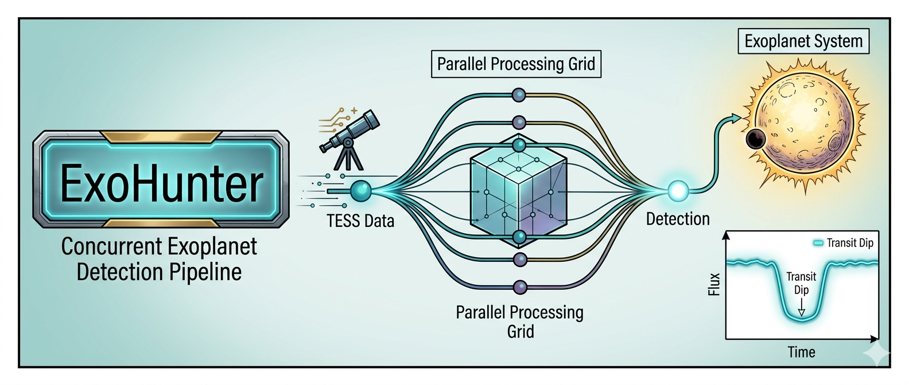
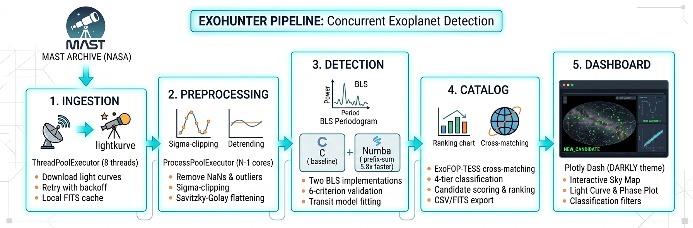

# ExoHunter
**Concurrent exoplanet transit detection pipeline for NASA TESS data**




[](https://www.python.org/downloads/)
[](LICENSE)
[]()

---

## What is this?

When a planet passes in front of its host star, the star's brightness
dips by a tiny fraction — typically less than 1%. NASA's
[TESS](https://tess.mit.edu/) space telescope stares at hundreds of
thousands of stars, recording their brightness every 2 minutes, producing
enormous datasets where these dips hide in noise.

**ExoHunter** automates the search. It downloads TESS light curves,
cleans them, runs the Box Least Squares (BLS) algorithm to find periodic
dips, validates candidates against astrophysical criteria, cross-matches
against the ExoFOP-TESS catalog of known TOIs, and presents everything
in an interactive dashboard that highlights uncatalogued candidates.

The project serves a dual purpose:

- **Scientific tool** — a functional pipeline that can recover known
  exoplanets (tested on TOI-700, a system with a rocky planet in the
  habitable zone) and flag new candidates not in any catalog.
- **Teaching resource** — a documented, well-structured codebase for a
  study group of Computer Science undergraduates at
  [UFPB](https://www.ci.ufpb.br/) (Universidade Federal da Paraiba),
  focused on concurrent programming and scientific software development.

---

## How it works



### The ExoHunter Pipeline: Architectural Overview

This infographic illustrates the five-stage **ExoHunter** data processing pipeline for concurrent exoplanet transit detection using NASA TESS data. The system is designed for high performance and scalability, moving sequentially from data ingestion to final candidate visualization.

#### Layered Concurrency Model

A key feature of the pipeline is its optimized concurrency model, which uses specialized thread and process pools to address different bottlenecks in the data workflow:

1.  **INGESTION**
    * **Description:** Data acquisition layer that downloads TESS light curves.
    * **Architecture:** Uses a `ThreadPoolExecutor` (8 threads) to manage multiple simultaneous downloads, mitigating network latency. It includes retry logic with exponential backoff and a local FITS cache to save previously downloaded files, using `astropy.io`.
    * **Icons:** A TESS telescope observing a star system and a direct download symbol.

2.  **PREPROCESSING**
    * **Description:** Signal cleaning and data conditioning.
    * **Architecture:** Utilizes a `ProcessPoolExecutor` (all N-1 CPU cores) for true parallel processing of multiple stars, bypassing Python's GIL. This stage removes outliers via sigma-clipping, normalizes the flux, and detrends stellar variability using a Savitzky-Golay flattening filter.
    * **Icons:** A "sigma-clipping" plot showing outlier removal and a "normalization/detrending" plot showing a stabilized light curve.

3.  **DETECTION**
    * **Description:** The core transit search engine.
    * **Architecture:** Employs a JIT-compiled parallel loop via `numba.prange`. It features two implementations of the Box Least Squares (BLS) algorithm: a standard production-baseline C implementation and a custom **Numba prefix-sum optimization** that achieves **5.8x faster** processing than the C baseline for large period searches. It also performs transit validation.
    * **Icons:** A BLS Periodogram graph (power vs. period) and side-by-side performance indicators for the 'C (baseline)' and 'Numba (optimized)' engines.

4.  **CATALOG**
    * **Description:** Results management and verification.
    * **Action:** This stage manages the generated candidate catalog. It performs real-time cross-matching against the [ExoFOP-TESS TOI catalog](https://exofop.ipac.caltech.edu/tess/) and ranks candidates using a unique **4-tier classification** and scoring system. Data can be exported to standard CSV or scientific FITS table formats.
    * **Icons:** A bar graph showing 'Ranking & Scoring' and an interactive globe icon symbolizing 'Cross-matching'.

5.  **DASHBOARD**
    * **Description:** Final visualization and analysis layer.
    * **Technology:** Built with Plotly Dash (using a custom DARKLY theme), it presents pipeline results in an interactive interface. It includes a sky map with RA/Dec coordinates, detailed light curve plots with model fits, a phase diagram, and filterable candidate tables.
    * **Icons:** A screen mockup showing the fully interactive dashboard application, displaying multiple data plots.

### Concurrency model

| Stage | Bottleneck | Strategy | Why |
|-------|-----------|----------|-----|
| Download | Network latency | `ThreadPoolExecutor` | Threads release the GIL during I/O waits |
| Preprocessing | CPU (SG filter) | `ProcessPoolExecutor` | Separate processes bypass the GIL |
| BLS search | CPU (nested loops) | `numba.prange` | JIT-compiled parallel loop over period grid |

### BLS performance

| Implementation | 10k periods, 20k cadences | Notes |
|---|---|---|
| Numba (prefix-sum bins) | **0.20 s** | Binned cumulative sums, O(n_periods × n_bins) |
| lightkurve/astropy (C) | 1.19 s | Production baseline |

*Measured on Intel Core i7-13650HX (20 threads), 32 GB RAM, WSL2 Linux.*

---

## Installation

### Requirements

- Python 3.11 or later
- ~2 GB disk for TESS data cache (optional — tests run offline)

### Steps

```bash
git clone https://github.com/dobidu/exohunter.git
cd exohunter

python -m venv venv
source venv/bin/activate    # Linux / macOS
# venv\Scripts\activate     # Windows (PowerShell)

pip install -e ".[dev]"
pytest                       # 152 tests, all offline
```

### Download the TOI catalog (optional, for cross-matching)

```bash
python -m exohunter.catalog.crossmatch --update
```

Fetches the latest TOI catalog from the
[NASA Exoplanet Archive](https://exoplanetarchive.ipac.caltech.edu/)
via TAP API (~7,900 TOIs), cached to `data/catalogs/toi_catalog.csv`.
The cache auto-refreshes every 48 hours (configurable via
`TOI_CATALOG_MAX_AGE_HOURS` in `config.py`). If TAP is unavailable,
falls back to ExoFOP HTTP, then to the local CSV, then to a built-in
reference table (TOI-700, L 98-59).

---

## Quick start

### 1. Demo: detect transits in TOI-700

[TOI-700](https://exoplanets.nasa.gov/exoplanet-catalog/7467/toi-700-d/)
is a nearby M-dwarf with three confirmed planets. Planet **d** orbits in
the habitable zone — the region where liquid water could exist.

```bash
python scripts/demo_single_star.py
```

The script downloads all available TESS sectors for TOI-700, runs the
full pipeline, prints a summary of detected candidates, and saves
interactive HTML plots to `data/output/`.

### 2. Launch the interactive dashboard

```bash
python scripts/run_dashboard.py          # defaults to demo (TOI-700)
python scripts/run_dashboard.py --empty  # start empty
```

Open [http://localhost:8050](http://localhost:8050) in your browser.

The dashboard features:

| Component | Description |
|-----------|-------------|
| **Data source selector** | Switch between TOI-700 demo and batch sector results |
| **New candidates panel** | Highlighted list of uncatalogued candidates (bright green) |
| **Sky map** | All targets in RA/Dec, color-coded by classification |
| **Light curve** | Time series with transit model overlay and range slider |
| **Phase diagram** | Phase-folded data with binned means and model fit |
| **Candidate table** | Sortable, filterable table with classification badges |
| **Classification filter** | Toggle NEW_CANDIDATE, KNOWN_MATCH, KNOWN_TOI, HARMONIC |
| **Multi-planet support** | Dropdown to switch between candidates for the same star |
| **BLS periodogram** | Power vs. period with detected peak and harmonics marked |
| **Odd-even comparison** | Overlaid odd/even transit curves with EB consistency check |
| **Cache statistics** | Number of cached targets, total size, largest files |
| **ML model status** | Shows which classifiers (RF/CNN) are trained and available |
| **Batch results index** | All sector CSVs with target counts, dates, NEW_CANDIDATE badges |
| **Reports gallery** | Thumbnail grid of diagnostic PNGs — click to expand full-size |
| **Alerts feed** | Timeline of NEW_CANDIDATE alerts with candidate details |

### 3. Batch process an entire TESS sector

```bash
# Process sector 56 — stars with TESS magnitude 10–14
python scripts/run_batch.py --sector 56

# Multi-sector mode: stitch all available sectors per target,
# auto-extend BLS period range to half the baseline (detects P > 30 d)
python scripts/run_batch.py --sector 56 --multi-sector

# Single-sector mode: download only the specified sector (faster)
python scripts/run_batch.py --sector 56 --single-sector

# Test with a small subset
python scripts/run_batch.py --sector 56 --limit 20

# Multi-planet mode: iteratively subtract transits and re-run BLS
python scripts/run_batch.py --sector 56 --multi-planet

# ML classification: add ml_class and ml_prob_planet to each candidate
python scripts/run_batch.py --sector 56 --classify

# Combine all modes
python scripts/run_batch.py --sector 56 --multi-sector --multi-planet --classify

# Custom magnitude range and period search
python scripts/run_batch.py --sector 56 --mag-min 9 --mag-max 12 --max-period 30
```

The batch script:
1. Queries MAST for all 2-min cadence targets in the sector
2. Filters by TESS magnitude via the TIC catalog (default: 10–14 Tmag)
3. Downloads concurrently with `ThreadPoolExecutor` (cached after first run)
4. Preprocesses, runs BLS, validates, cross-matches each target
5. Prints a summary with status breakdown and top 10 candidates by SNR
6. Saves results to `data/results/sector_XX.csv`

**Sector modes:**

| Flag | Downloads | BLS max period | Use case |
|------|-----------|---------------|----------|
| *(default)* | All available sectors | 20 days (fixed) | Standard search |
| `--multi-sector` | All available sectors | Auto: baseline / 2 (up to 200 d) | Long-period planets (P > 30 d) |
| `--single-sector` | Specified sector only | 20 days (fixed) | Fast processing |

In `--multi-sector` mode, the number of BLS trial periods is scaled
proportionally to the period range (capped at 50,000) to maintain
resolution.

Results are automatically available in the dashboard via the data source
selector — no restart needed.

### 4. Single-target CLI

```bash
python scripts/run_pipeline.py --tic "TIC 150428135"
python scripts/run_pipeline.py --tic "TIC 150428135" --min-period 1.0 --max-period 40.0
```

### 5. Inspect a promising candidate

Generate a 4-panel diagnostic report (PNG) for a candidate:

```bash
python scripts/inspect_candidate.py --tic "TIC 150428135" --period 37.426
```

The report includes: light curve with transit windows, phase-folded
data with trapezoidal model fit (depth, Rp/R\*, impact parameter),
BLS periodogram with harmonics, and odd-even transit comparison for
eclipsing binary discrimination. Saved to `data/reports/TIC_<number>.png`.

### 6. Train and use the ML classifier

```bash
# Download Kepler KOI + ExoFOP training data (~7,600 labeled examples)
python scripts/download_training_data.py

# Train the Random Forest (3 classes: planet, eclipsing_binary, false_positive)
python scripts/train_classifier.py --validate-tess

# Run batch processing with ML classification
python scripts/run_batch.py --sector 56 --classify --limit 20
```

The classifier adds `ml_class` and `ml_prob_planet` columns to the
output CSV and the dashboard candidate table. See [ML_GUIDE.md](ML_GUIDE.md)
for the full walkthrough.

---

## Cross-matching and candidate classification

Every validated candidate is compared against the
[NASA Exoplanet Archive](https://exoplanetarchive.ipac.caltech.edu/)
TOI catalog (fetched live via TAP API, with ExoFOP HTTP and local CSV
as fallbacks) and classified into one of four tiers:

| Classification | Meaning | Dashboard color |
|---|---|---|
| **NEW_CANDIDATE** | TIC ID not in any catalog — potential new exoplanet | Bright green |
| **KNOWN_MATCH** | TIC ID and period match a known TOI — re-detection | Blue |
| **KNOWN_TOI** | TIC is a known TOI but at a different period | Yellow |
| **HARMONIC** | Period is 2×, 3×, 0.5×, or 1/3× of a known TOI | Orange |

`NEW_CANDIDATE` is the most exciting — it means ExoHunter found a
periodic signal in a star that has no catalogued TOI, making it a
potential undiscovered exoplanet.

### Candidate scoring

Candidates are ranked by a priority score for visual inspection:

```
score = SNR × v_shape_factor × depth_factor
```

| Factor | Value | Condition |
|--------|-------|-----------|
| `v_shape_factor` | 1.0 | Transit is box-like (V-shape metric < 0.5) |
| `v_shape_factor` | 0.5 | Transit is V-shaped (possible eclipsing binary) |
| `depth_factor` | 1.0 | Transit depth < 2% (plausible planet) |
| `depth_factor` | 0.7 | Transit depth >= 2% (possible binary/blend) |

The top 20 candidates by score are the most promising for follow-up.

---

## Project structure

```
exohunter/
├── config.py                    # Paths, physical constants, default parameters
│
├── ingestion/                   # Layer 1: Data acquisition
│   ├── downloader.py            #   Concurrent TESS downloads (MAST API + threads)
│   └── cache.py                 #   Local FITS cache (astropy Table roundtrip)
│
├── preprocessing/               # Layer 2: Signal cleaning
│   ├── pipeline.py              #   Orchestrator (ProcessPoolExecutor)
│   ├── clean.py                 #   NaN removal, sigma-clipping
│   ├── normalize.py             #   Median flux → 1.0
│   └── detrend.py               #   Savitzky-Golay flattening
│
├── detection/                   # Layer 3: Transit search
│   ├── bls.py                   #   BLS: lightkurve (C) + Numba (prefix-sum)
│   ├── validator.py             #   6-criterion candidate validation
│   └── model.py                 #   Trapezoidal transit model, phase-folding
│
├── catalog/                     # Layer 4: Results management
│   ├── candidates.py            #   Catalog with scoring and ranking
│   ├── crossmatch.py            #   ExoFOP-TESS 4-tier classification
│   └── export.py                #   CSV, FITS, and VOTable export
│
├── classification/              # Layer 4b: ML classification
│   ├── datasets.py              #   Download + prepare Kepler KOI / ExoFOP
│   ├── features.py              #   Candidate → 10-feature vector
│   └── model.py                 #   RandomForest train / save / load / predict
│
├── dashboard/                   # Layer 5: Visualization
│   ├── app.py                   #   Dash application factory
│   ├── layouts.py               #   DARKLY layout with sector selector
│   ├── callbacks.py             #   Interactive callbacks + data loading
│   └── figures.py               #   Plotly figure generators
│
└── utils/                       # Shared infrastructure
    ├── logging.py               #   Structured logging (never print())
    ├── timing.py                #   @timing decorator for profiling
    └── parallel.py              #   Thread/process pool wrappers with tqdm
```

### Scripts

| Script | Purpose |
|--------|---------|
| `scripts/demo_single_star.py` | End-to-end demo on TOI-700 (3 planets) |
| `scripts/run_pipeline.py` | CLI for single-target processing |
| `scripts/run_batch.py` | Batch sector processing (supports `--multi-sector` / `--single-sector`) |
| `scripts/run_dashboard.py` | Dashboard server with demo data generator |
| `scripts/inspect_candidate.py` | Deep 4-panel diagnostic report for a candidate (PNG) |
| `scripts/download_training_data.py` | Download Kepler KOI + ExoFOP datasets for ML training |
| `scripts/train_classifier.py` | Train the Random Forest transit classifier |

### Notebooks

| Notebook | Audience | Description |
|----------|----------|-------------|
| [`00_lecture_introduction`](notebooks/00_lecture_introduction.ipynb) | First-time students | Theory + implementation explained together with interactive animations (transit geometry, preprocessing steps, BLS intuition, validation flowchart) |
| [`01_exploratory`](notebooks/01_exploratory.ipynb) | All students | Guided pipeline walkthrough on TOI-700 — download, preprocess, BLS, phase-fold sweep animation, multi-planet search |
| [`02_student_exercises`](notebooks/02_student_exercises.ipynb) | Graded assignment | Independent analysis of L 98-59 — discover the planets, validate, cross-match, measure detection limits via injection-recovery |

---

## Validation criteria

Every BLS detection passes through six tests before being accepted:

| # | Test | Threshold | Rationale |
|---|------|-----------|-----------|
| 1 | **SNR** | >= 7.0 | Community standard for transit detection |
| 2 | **Depth** | 0.01%–5% | Too shallow = noise; too deep = eclipsing binary |
| 3 | **Duration/period** | 0.1%–25% | Must be physically consistent with Kepler's 3rd law |
| 4 | **Transit count** | >= 3 | Minimum for a reliable periodic signal |
| 5 | **V-shape** | <= 0.5 | Box-like = planet; V-shaped = eclipsing binary |
| 6 | **Harmonics** | Not 2:1 or 3:1 | Flags period aliases of stronger signals |

Tests 1–4 are hard requirements. Tests 5–6 produce warnings that affect
the candidate score but do not reject the candidate outright.

---

## Running tests

```bash
pytest                                          # 152 tests, all offline
pytest -v                                       # verbose
pytest --cov=exohunter --cov-report=term-missing  # with coverage
pytest tests/test_bls.py -v                     # single module
```

The test suite uses synthetic light curves with injected transits at
known periods and depths. It verifies:

- **Preprocessing**: transit signal survives cleaning; outliers removed;
  normalization produces median = 1.0.
- **BLS detection**: correct period recovered within 0.05 days; depth
  within 2x of injected value; Numba implementation agrees with
  lightkurve.
- **Validation**: each of the six criteria correctly accepts good
  candidates and rejects bad ones.

---

## Technology stack

| Domain | Libraries |
|--------|-----------|
| TESS data access | [lightkurve](https://docs.lightkurve.org/), [astroquery](https://astroquery.readthedocs.io/), [astropy](https://www.astropy.org/) |
| Numerical computing | numpy, scipy, [numba](https://numba.pydata.org/) |
| Visualization | [plotly](https://plotly.com/python/), [dash](https://dash.plotly.com/), dash-bootstrap-components |
| Concurrency | concurrent.futures (`ThreadPoolExecutor`, `ProcessPoolExecutor`), numba `prange` |
| Catalog cross-matching | [ExoFOP-TESS](https://exofop.ipac.caltech.edu/tess/) TOI catalog (7,900+ entries) |
| ML classification | scikit-learn (RandomForest), trained on [Kepler KOI](https://exoplanetarchive.ipac.caltech.edu/) (~7,600 labeled examples) |
| Testing | pytest, pytest-cov |

---

## Documentation

| Document | Audience | Contents |
|----------|----------|----------|
| [00_lecture_introduction.ipynb](notebooks/00_lecture_introduction.ipynb) | First-time students | Interactive lecture: theory + code with animated infographics |
| [THEORY.md](THEORY.md) | Students new to astronomy | Transit method, TESS mission, BLS algorithm, noise sources, validation criteria, TOI-700 system, further reading |
| [METHODOLOGY.md](METHODOLOGY.md) | Developers | Pipeline stages, algorithms, data structures, configuration reference, dashboard callback chain, testing strategy |
| [ML_GUIDE.md](ML_GUIDE.md) | Students / ML practitioners | Dataset download, feature engineering, model training, classifier usage, architecture, extension ideas |
| [CONTRIBUTING.md](CONTRIBUTING.md) | Contributors | Setup, code conventions, commit format, open contribution areas by difficulty |

---

## Roadmap

- [x] ~~Batch mode: process an entire TESS sector end-to-end~~
- [x] ~~Cross-matching with ExoFOP-TESS TOI catalog~~
- [x] ~~Candidate scoring and ranking system~~
- [x] ~~Numba BLS optimized with prefix-sum algorithm (5.8x faster than C)~~
- [ ] BLS implementation in C with OpenMP for comparison benchmarks
- [x] ~~ML candidate classification (Random Forest trained on Kepler KOI, 3 classes)~~
- [x] ~~CNN classification on phase curves (1D CNN on phase-folded light curves via PyTorch)~~
- [x] ~~Real-time query to the NASA Exoplanet Archive via astroquery TAP~~
- [x] ~~Automatic alerts for new candidate detections~~
- [x] ~~VOTable export for Virtual Observatory interoperability~~
- [ ] GPU-accelerated BLS using CUDA (via Numba or CuPy)
- [x] ~~Multi-planet search: iteratively subtract detected transits and re-run BLS~~

---

## License

[MIT](LICENSE)

## Acknowledgments

- **TESS** — This project uses public data from the Transiting Exoplanet
  Survey Satellite, a NASA Explorer mission led by MIT and operated by
  MIT Lincoln Laboratory.
- **MAST** — Data accessed via the Mikulski Archive for Space Telescopes
  at the Space Telescope Science Institute.
- **ExoFOP** — Cross-matching uses the TOI catalog from the
  [Exoplanet Follow-up Observing Program](https://exofop.ipac.caltech.edu/tess/)
  at IPAC/Caltech.
- **lightkurve** — The [lightkurve](https://docs.lightkurve.org/) package
  is developed by the Kepler/K2 and TESS community.

---

*Built at [UFPB's Centro de Informatica](https://ci.ufpb.br/) as a
teaching resource for concurrent programming and scientific computing.*
